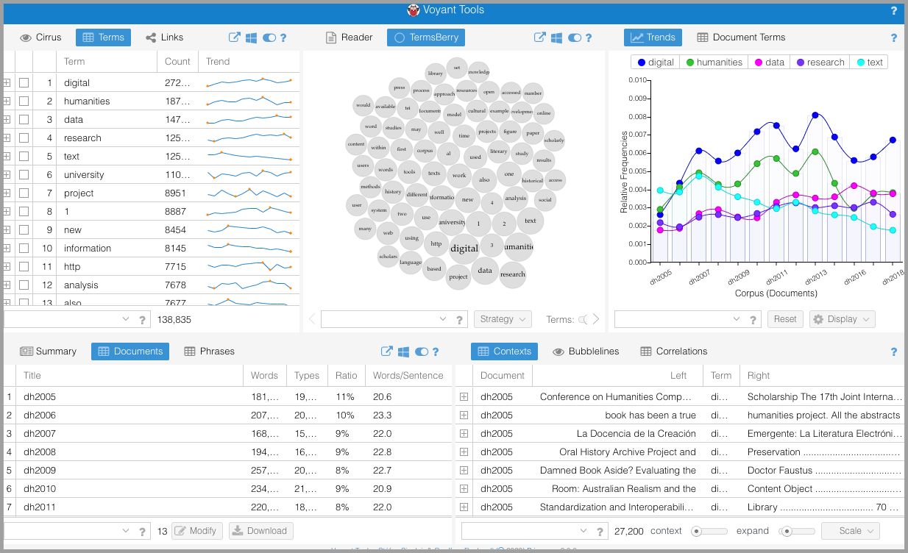

# Analyze DH conference abstracts with Voyant

Let's see how far we can get by using text analysis to understand recent scholarship in digital humanities! We'll use Voyant, a kind of Swiss Army knife for text analysis, to analyze the abstracts of papers presented at the annual Digital Humanities conference sponsored by the Alliance for Digital Humanities Organizations.

Click [here](https://voyant-tools.org/?corpus=b7ccfc7da3f523ff503d5f20d82427c1&amp;stopList=keywords-1d616089b51c15c9ed1d6510656f04f7&amp;panels=corpusterms,termsberry,trends,documents,contexts) (rel=undefined target=undefined) to open up Voyant pre-loaded with our texts.

### 1. What am I looking at? (1)

This somewhat overwhelming array of panels constitutes the interface for the text-analysis tool Voyant. Each panel offers a different tool: a way of analyzing the same set of documents. And there are more tools, too! Voyant allows you to swap tools in and out of the panels in order to jump between different ways of seeing the same text.

So what text are we looking at? I've pre-loaded Voyant with a **corpus** (a collection of documents): 13 different text files, one for each year between 2005 and 2018 (except 2015 is missing for some reason). Each "document" is the book of abstracts for that year's international Digital Humanities conference. (A conference abstract is a short synopsis of the presentation the author plans to give. [Here's](https://zenodo.org/record/1403230) (rel=undefined target=undefined) where I got the documents.)

### 2. What am I looking at? (2)

Let's try to make this a little less overwhelming by walking through each of the current panels.

1. The **Terms** list shows you the frequency with which individual words appear, from most frequent to least frequent. You'll notice that a tiny graph appears in the "Trend" column; that's called a "sparkline," and it's a quick way of seeing how the frequency of the term rises and falls over the years. Try clicking on the tiny "plus" sign in the left-most column for a given word.
2. The **Documents** list shows you which documents are included in your corpus, one row for each separate document. You'll also see some quick statistics for each document, such as how many words each contains and what percent of the total corpus each document constitutes.
3. The **TermsBerry** tool shows you various words that appear in your corpus, their bubbles sized according to frequency. The highest-frequency terms appear in the middle of the cluster; the darkness of the bubble indicates the proportion of documents in which the term appears. If you hover over a term, the bubbles' colors change to indicate the frequency with which other terms appear close to the highlighted term. For example, if you hover over "digital," you'll see that the term "humanities" turns a dark shade, indicating that the two terms frequently appear near each other.
4. The **Trends** graph shows you the frequency with which individual terms appear over the entirety of the corpus. If you click on a term in the TermsBerry tool, the Trends graph will show the frequency of that term. You can also check the box in the second column of the Terms tool to add additional terms to the graph.
5. The **Keywords in Context** tool shows you a little bit of context for any term you select, in order to give you a quick sense of how it's used. You can switch out the term using the checkbox in the Terms tool or by searching for any word using the search box at the bottom of the panel.

### 3. A closer look at the interface

There's a *lot* packed into Voyant, and you have to understand the interface a little bit in order to get a sense of the range.

If you hover your cursor over the bar at the top of each panel, you'll notice that several icons appear on the right.

1. You can export a URL for any visualization you create. That way, you can share a link or embed the visualization in another website.
2. You can swap out any tool for any other tool. Click on this icon to see a list of the many, many other tools Voyant offers. You can always get back to the "dashboard" view we started with by clicking on the "swap tool" icon at the very top of the Voyant page and selecting "Corpus View."
3. In case Voyant wasn't overwhelming enough, each tool has configurable options!
4. The help material is genuinely useful. Hover over the "help" icon to get a quick summary of the tool's purpose, and click on the icon to go to a dedicated help page for that tool.

### 4. Switch it up

This default, "Corpus View" arrangement of Voyant's panels includes some suggested tools to swap in and out.

In the top portion of the terms panel (the panel labeled **1** in the first step of this tutorial), you'll notice a button labeled **Cirrus**. Click the button to switch to a word cloud!

You can try the **Links** button, too, to see which words tend to be "linked" together (i.e., they occur in proximity to each other).

Try some of the buttons in the other panels. Remember, you can learn what any tool does by hovering over or clicking on the help icon.

### 5. Stopwords

When I told you that I preloaded Voyant with the books of abstracts, I didn't tell you the whole truth. In fact, when you load documents into a text analysis tool without modification, you'll often be overwhelmed by the words that occur with a great deal of frequency: words like "the," "and," "an," "a," etc. They can make it hard to see more distinctive words.

In order to get around this problem, I loaded Voyant with [**stopwords**](https://kavita-ganesan.com/what-are-stop-words/) (rel=undefined target=undefined): a list of terms to ignore. If you click on the **Options** icon at the top of any panel, you'll see that there are some options for Stopwords. You can click on **Edit List** to see which stopwords I've included. (They come from standard lists of stopwords in [English](https://gist.github.com/sebleier/554280) (rel=undefined target=undefined), [French](https://github.com/stopwords-iso/stopwords-fr/blob/master/stopwords-fr.txt) (rel=undefined target=undefined), and [Spanish](https://github.com/stopwords-iso/stopwords-es/blob/master/stopwords-es.txt) (rel=undefined target=undefined), since some abstracts are in other languages.) You can add your own stopwords by putting the term on a new line in the stopwords list. For example, you can get rid of the terms "digital" and "humanities" by putting each word on its own line.

### 6. Switch it up again

Let's look at another tool you might be interested in. This tool benefits from more screen space, so we'll switch to a view that uses the entire browser window, rather than just a portion of it. Hover over the blue bar at the very top of your Voyant window until the icons appear on the right. Click on the "switch tool" icon (it looks kind of like the Windows icon) and then click on **Corpus Tools** (**1**). Then select **Topics** (**2**).

### 7. Investigate topics

The Topics tool uses machine learning to "discover" clusters of words that tend to appear together throughout the corpus. These word-clusters are referred to as "topics," and this process is called "topic modeling."

The clusters of words at left appear together, to varying degrees, in each of the documents in our corpus. The computer just finds the word clusters; it can't tell you what the clusters represent or why the words appear together. You have to use your own judgment to "name" the topics!

The documents list, at right, shows you the relative proportion of each document composed of each topic.

Are your topics different than mine? That's because there's an element of randomness involved in topic modeling. I know, it's confusing; click on the "help" icon to learn more about the process.

At the bottom of the screen, you'll see that you can increase the number of topics the tool finds by adjusting the scrubber.

What happens if you increase the number of topics?

Can you find any patterns? Do certain topics appear in large proportion in some years but not in others?

You can see how topic modeling might be usefully applied by looking at [a topic model for the journal *Signs*](https://signsat40.signsjournal.org/topic-model/) (rel=undefined target=undefined).

### 8. Your turn!

Now it's your turn to explore! Switch among the tools and investigate to see what each can tell you about our corpus.

Share your findings with the other members of your group. Let's see which group can find the most interesting pattern, trend, or fact about the corpus!

